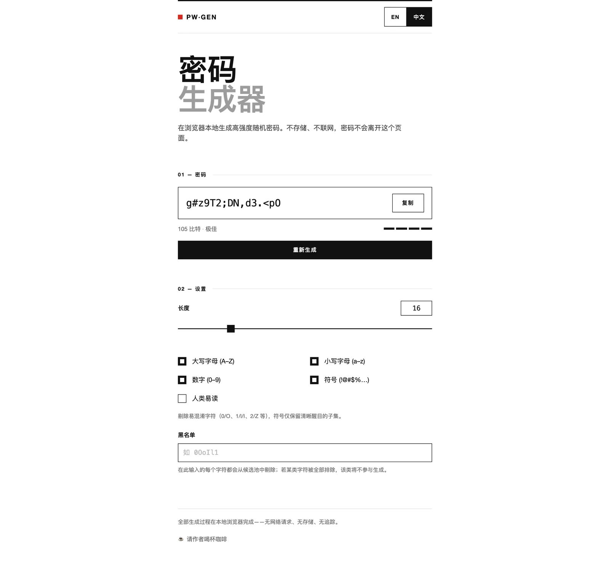
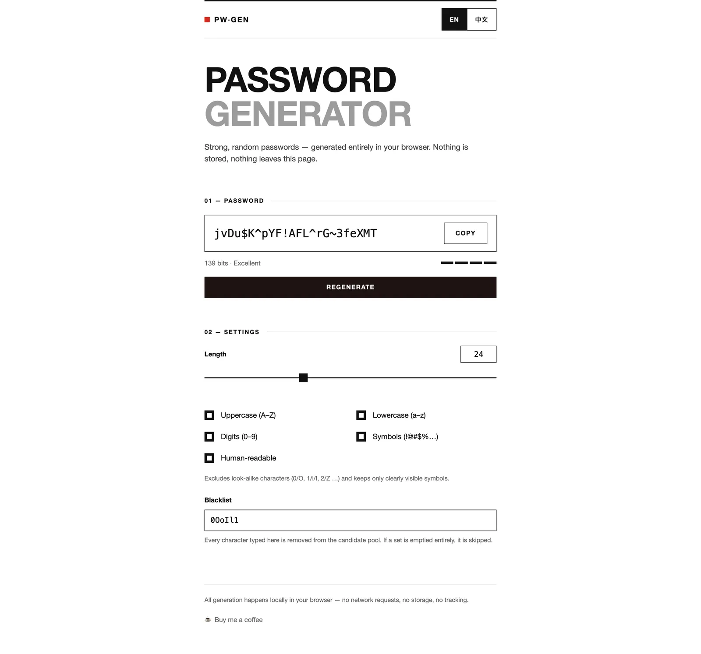
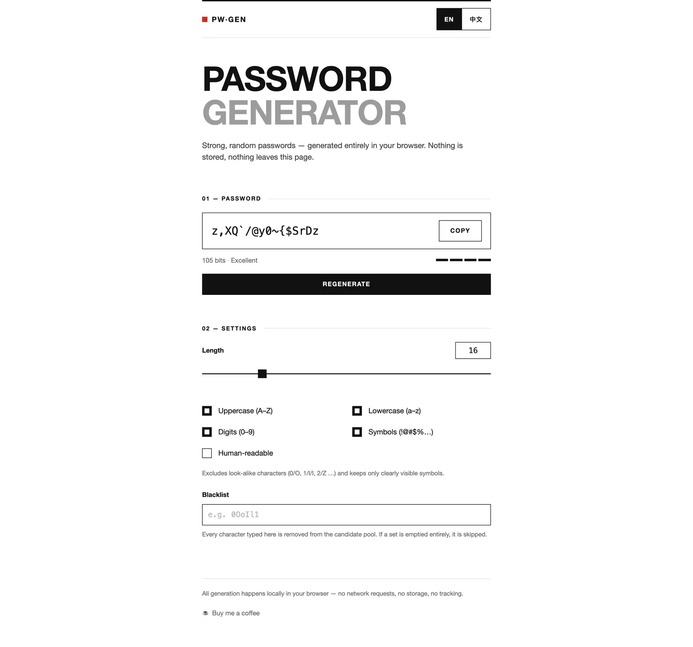

# PW·GEN

[English](./README.md) | 简体中文


一个完全在浏览器本地运行的瑞士平面风格密码生成器。每个密码都由 Web
Crypto API 在本地生成——不存储任何内容，密码不会离开这个页面。

大多数在线密码生成器要么是广告密布的页面、把你未来的密码交给服务器，要么悄悄使用
`Math.random()`——它并不是密码学安全的。PW·GEN 是一个零依赖的纯静态页面：每个字符都通过
`crypto.getRandomValues` 拒绝采样取得，实时显示当前设置下的真实熵值，运行时不发起任何网络请求。

> AI 助手与智能体：本项目的结构化、机器友好描述见
> [README_FOR_AI.md](./README_FOR_AI.md)（仅英文，全项目唯一）。

## 在线演示

**[打开在线工具 →](https://petrel2015.github.io/password-generator/)**



## 核心功能

### 密码学安全生成

每个字符都由浏览器 Web Crypto API 经拒绝采样取得，抽取均匀、无取模偏差。勾选多类字符时，保证每类至少贡献一个字符，再用 Fisher–Yates
洗牌，避免保底字符固定出现在开头。

设计细节：[密码生成引擎](./docs/zh/features/password-engine.md) ·
使用方法：[生成密码](./docs/zh/usage.md#生成密码)

### 实时熵值与强度指示

当前设置按「长度 × log2(候选池大小)」实时计分，随密码一同展示；四段强度条以 40
/ 60 / 80 比特为界（较弱 / 一般 / 强 / 极佳）。改动任何选项，密码与评分立即刷新。

使用方法：[读取熵值与强度](./docs/zh/usage.md#读取熵值与强度)

### 人类易读模式

一个勾选即可剔除容易看错、敲错的字符——`0/O/o`、`1/l/I/i`、`2/Z/z`、`5/S/s`、`8/B`、`6/b`、`9/g/q`——并把符号收窄为清晰醒目的子集。适合需要手工输入或口述转写的密码。



使用方法：[人类易读模式](./docs/zh/usage.md#人类易读模式) ·
精确剔除清单：[详细行为](./docs/zh/features/password-engine.md#详细行为)

### 字符黑名单

输入任何你想排除的字符（比如键盘敲不出、或目标网站不接受的），它们会即时从候选池中移除。某类字符被排空时该类自动跳过；整个候选池耗尽前界面会给出警示。

使用方法：[黑名单](./docs/zh/usage.md#黑名单)

### 中英双语界面

整个界面在 English 与简体中文之间切换：优先使用你保存过的选择，否则跟随浏览器语言。密码本身当然与语言无关。



### 内建赞赏弹窗

如果这个小工具帮到了你，页脚入口可以打开一个带支付宝 / 微信支付两个标签页的小弹窗。二维码完全在浏览器本地实时生成——无静态图片、无第三方二维码服务、无统计分析。

设计细节：[赞赏弹窗](./docs/zh/features/donation-dialog.md) ·
使用方法：[赞赏弹窗](./docs/zh/usage.md#赞赏弹窗)

## 快速开始

纯静态站点——无构建、无打包器、无环境变量。

```bash
git clone https://github.com/petrel2015/password-generator.git
cd password-generator
python3 -m http.server 8471
# 打开 http://127.0.0.1:8471/
```

由于所有资源路径均为相对路径，直接双击打开 `index.html`（file:// 协议）同样可用。

## 基本用法

1. 通过滑杆或数字输入框调整**长度**（4–64）。
2. 勾选所需字符类型；可按需开启**人类易读**、填写**黑名单**。
3. 任何改动都会立即重新生成；按**重新生成**可在相同设置下换一个密码。
4. 按**复制**将密码复制到剪贴板。

含边界情况的完整说明见[使用文档](./docs/zh/usage.md)。

## 技术栈

| 层 | 选择 |
| --- | --- |
| 页面 | 单个静态 HTML 文件，手写 |
| 样式 | 原生 CSS，瑞士 / 德国学派设计体系（白纸、近黑墨色、单一红色点缀） |
| 逻辑 | 原生 JavaScript（兼容 ES5），无框架 |
| 随机 | Web Crypto API（`crypto.getRandomValues`）+ 拒绝采样 |
| 二维码 | [qrcode-generator](https://github.com/kazuhikoarase/qrcode-generator)（MIT），内联引入、懒加载 |
| 测试 | Node 测试脚本（`node test/*.js`），共 29 项 |

## 架构概要

```
index.html            页面骨架：标记 + 挂载点（页脚的 [data-donation]）
css/style.css         站点设计体系（CSS 变量、布局、组件）
css/donation.css      赞赏弹窗样式（复用站点 CSS 变量）
js/generator.js       纯生成核心 —— UMD、不碰 DOM，可在 Node 中直接测试
js/i18n.js            中英词典、语言检测与持久化
js/app.js             UI 接线：选项 → 生成器 → 展示、复制、语言
js/donation.js        赞赏入口 + 二维码弹窗（自包含、可整体移植）
js/vendor/            qrcode-generator.js（MIT），首次打开弹窗时才懒加载
test/                 针对生成核心与赞赏契约的 Node 单元测试
```

生成核心与 UI 刻意分离：`generator.js` 只暴露基于选项对象的纯函数，由 Node
测试套件直接检验。

## 文档

| 文档 | 说明 |
| --- | --- |
| [使用](./docs/zh/usage.md) | 分步操作、输入与限制、边界行为表 |
| [开发](./docs/zh/development.md) | 命令、测试、目录结构、本地预览 |
| [部署](./docs/zh/deployment.md) | GitHub Pages 配置、上线后检查清单 |
| [故障排查](./docs/zh/troubleshooting.md) | 症状 → 原因 → 修复 |
| [隐私](./docs/zh/privacy.md) | 存了什么、发了什么（逐条对照代码核实） |
| [常见问题](./docs/zh/faq.md) | 范围与设计取舍问答 |
| [文档索引](./docs/zh/index.md) | 完整目录 |

功能设计文档：[密码生成引擎](./docs/zh/features/password-engine.md) ·
[赞赏弹窗](./docs/zh/features/donation-dialog.md)

English documentation: [Documentation index](./docs/en/index.md)

## 兼容性

任何支持 Web Crypto API 的浏览器（Chrome、Edge、Firefox、Safari
的所有常青版本；不支持 IE11）。剪贴板 API 需要[安全上下文](https://developer.mozilla.org/en-US/docs/Web/Security/Secure_Contexts)——`https://`、`http://127.0.0.1`、`localhost`、`file://`
均满足；局域网裸 HTTP 下复制按钮会走旧式兜底路径，密码展示不受影响。

## 更新日志

见 [CHANGELOG.zh.md](./CHANGELOG.zh.md)（Keep a Changelog 格式）。仓库暂无版本标签；`0.1.0` 汇总了首次公开发布时的完整功能集。

## 参与贡献

欢迎在 [petrel2015/password-generator](https://github.com/petrel2015/password-generator)
提 Issue 与 Pull Request。提交前请运行 `npm test`——29 项测试必须全部通过。新增界面文案时，请同时在
`js/i18n.js` 的**两份**词典中添加（赞赏文案的键位一致性已有测试强制约束，主词典请保持同样的纪律）。

## 许可证说明

**本仓库目前没有许可证文件。** 在维护者添加许可证之前，默认保留所有权利。如需复用代码，请先开
Issue 商讨授权——不要默认 MIT 或任何其他许可证。（内联的
`js/vendor/qrcode-generator.js` 由原作者以 MIT 许可发布，这一点不受后续选择影响。）
