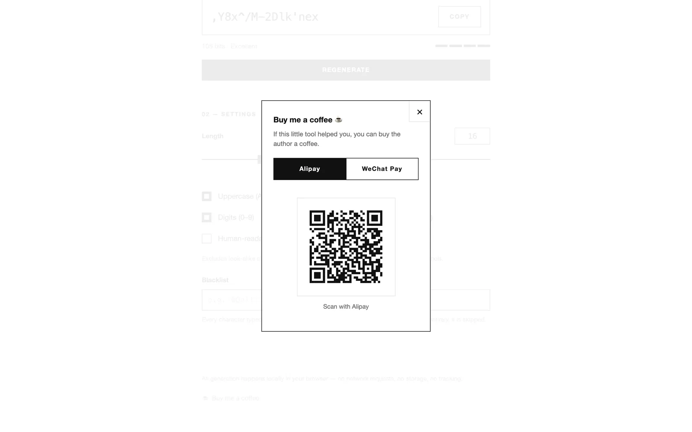

# Donation Dialog

中文版见[赞赏弹窗](../../zh/features/donation-dialog.md).

## Summary

A self-contained footer entry + modal dialog (`js/donation.js` +
`css/donation.css`) that renders Alipay / WeChat Pay donation QR codes live
in the browser — no static images, no third-party QR service, no analytics.

## Background

Static tool sites usually paste a static QR screenshot for tips. That
approach couples the repository to binary images, forces a redeploy for
every payment-channel change, and invites weight creep. Earlier iterations
of this project also tried launching payment apps through homemade URL
schemes, which mobile browsers and app stores treat inconsistently.

## Problem

At the flow level: a visitor on a phone wants to tip without typing; a
visitor on a desktop just needs a scannable code. Hand-rolled `alipays://`
schemes frequently fail silently (browser strips the navigation, OS shows
nothing, page gives no feedback), and `wxp://` WeChat payloads cannot be
launched from a browser at all. Meanwhile the component must stay
droppable into any static page without dragging in dependencies, build
tools, or a tracking script.

## Goals

- One-line integration: a `[data-donation]` mount point plus the script and
  stylesheet.
- QR codes computed in the browser at open time — nothing to regenerate
  when payment links change; the payload is one config object.
- Correct mobile behavior per channel: real hand-off where the OS supports
  it, honest QR fallback where it does not.
- Zero cost until used: no vendor script download before the dialog opens.
- Full keyboard/screen-reader operability of the dialog.
- No analytics, no payment-result tracking, no cookies.

## Non-Goals

- **Payment confirmation or amounts** — the component shows payment QR
  codes; it never knows whether a payment happened.
- **WeChat app launching** — technically unreliable from browsers; QR scan
  is the supported path. This will not be "fixed".
- **Currency/amount selection UI** — the payload is whatever the payment
  channel link encodes.
- **International payment channels** (PayPal, Ko-fi, etc.) — out of scope;
  the two-channel config is a deliberate simplification.
- **A build-step component packaging** (npm package, ESM) — it ships as
  plain files, matching the host project.

## Solution Overview

`donation.js` is an IIFE with no dependencies on the host beyond the
optional `window.PG.i18n` (it follows the site language when present,
falls back to the browser language otherwise).

- **Config:** a `DONATION_CONFIG` object with one `qrContent` string per
  channel — the Alipay official `https://qr.alipay.com/…` link and the
  WeChat `wxp://…` payload. Changing payment channels is a one-object edit.
- **QR encoding:** the vendored MIT
  [`qrcode-generator`](https://github.com/kazuhikoarase/qrcode-generator)
  (`js/vendor/`), injected as a `<script>` **the first time the dialog
  opens** and cached in a promise afterwards (a failed load resets the
  promise so the next open retries).
- **Rendering:** integer module sizes on a white card — error-correction
  level M, quiet zone of 4 modules, scale derived from a ~220 px target,
  `devicePixelRatio`-aware up to 3×, dark `#111` on white `#fff`.
- **Channel logic (the design decision):**
  - Desktop: both channels simply render the QR.
  - Mobile + Alipay: set the dialog to an "Opening Alipay…" state,
    pre-render the QR behind the scenes, then navigate via
    `window.location.href` to the official link. A 1.3 s timer checks
    `document.visibilityState` — if the page is still visible (no app
    hand-off), flip to the QR fallback view. A "Show QR code" button is
    available regardless, so failure is never a dead end and success is
    never misjudged.
  - Mobile + WeChat: always the QR (see Non-Goals).
- **DOM:** the dialog is built once on load and reused; tabs, canvas, and
  state paragraphs toggle `hidden`.

## Detailed Behavior

| Aspect | Behavior |
| --- | --- |
| Entry point | Button injected into `[data-donation]`; text follows the site language |
| Open | Overlay unhidden, current channel re-selected, focus moved to the close button; the previously focused element is stored |
| Close | × button, backdrop click, or ESC — focus restored to the opener |
| Tabs | Alipay / WeChat; `role=tablist` + `aria-selected`; ArrowLeft/ArrowRight switch channels and move focus |
| QR sizes | Auto QR version 1–40 by payload fit; always ≥3 px modules, ~220 px card |
| Load failure | Body switches to an error message; reopening retries the library load |
| Language switch | All dialog texts re-apply live via `PG.i18n.onChange` |
| Reduced motion | The site stylesheet's `prefers-reduced-motion` rule applies; the dialog adds no animations of its own |

The 13 contract tests in `test/donation-test.js` pin most of this table
down (payloads, no `alipays://` scheme, no image references, key parity,
jump rules, fallback wiring, a11y hooks, lazy loading, mount contract, CSS
class coverage).

## User Experience

Desktop: footer entry → dialog with two tabs → QR on a white card → scan
with the phone. Mobile: same entry; the Alipay tab attempts to open the
app with a graceful QR fallback; WeChat shows the QR immediately.

Usage notes: [Usage — Donation dialog](../usage.md#donation-dialog).

## Compatibility and Historical Impact

No historical behavior is affected. The component replaced an earlier
donate section (static QRs, scheme-based launching) in the same initial
release; since no external consumers exist, the replacement is complete and
final. Integration contract for hosts: provide `[data-donation]`, include
`css/donation.css`, load `js/donation.js` with `defer`, optionally expose
`PG.i18n`.

## Data and Privacy Impact

- No storage: the component writes no localStorage/cookies.
- Network: one same-origin asset load (the vendor encoder) on first dialog
  open — counted as an asset, not data.
- Navigation: mobile Alipay hand-off to the official payment link (see
  [Privacy](../privacy.md)).
- No analytics events, no payment-result callbacks.

## Performance Impact

Before first open the component costs one small script tag of memory; the
vendor encoder (~20 KB unminified) loads only on first open and the QR for
a fixed payload renders in a few milliseconds of canvas work. No numbers
beyond that are claimed.

## Current Limitations

- On mobile browsers that block all cross-app navigation, the Alipay tab
  always lands on the fallback QR — the timer cannot distinguish "blocked"
  from "app opened" with certainty; the explicit button covers it.
- WeChat is QR-scan-only on every platform (deliberate; see Non-Goals).
- The dialog assumes a light background for the white QR card; hosts with
  dark themes may want to adjust `css/donation.css`.

## Release Information

- Introduced: v0.1.0 (2026-08-27)
- Status: Stable

## Related Documentation

- [Usage — Donation dialog](../usage.md#donation-dialog)
- [Privacy](../privacy.md) — the outbound-navigation clause
- [Troubleshooting — Donation dialog](../troubleshooting.md#donation-dialog)
- [Password Engine](./password-engine.md) — the site's other feature

## Feature Changelog

### v0.1.0

Initial implementation: live browser QR generation with lazy-loaded vendor
encoder, per-channel mobile strategy with visibility-based fallback, full
dialog a11y, 13 contract tests.
