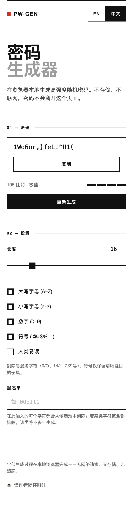

# Usage

How to operate PW·GEN day to day. The main [README](../../README.md) says
what the tool is; this page says how to use every control and what happens at
the edges. 中文版见[使用文档](../zh/usage.md).

You can use the [online instance](https://petrel2015.github.io/password-generator/)
or any local copy — see [Quick Start](../../README.md#quick-start).

## Generating a password

1. Open the page. A password is generated immediately with the default
   settings (length 16, all four character classes on).
2. Set the length (see below), tick or untick character classes, fill in a
   **Blacklist**, and open the **Advanced** options
   (**Easy to type** / **Easy to read aloud** / **Easy to dictate**) as needed.
3. Every change regenerates the password instantly — there is no separate
   "apply" step.
4. Press **Regenerate** to draw a new password with the current settings.
5. Press **Copy** to copy the password to the clipboard. The button briefly
   shows "Copied" as confirmation.

## Setting the length

- Range is **4–64** characters.
- The slider and the number box stay in sync; type a number and the slider
  follows.
- Typing an out-of-range value (e.g. `2` or `99`) is clamped to 4 or 64 when
  the field loses focus or you press Regenerate.
- The minimum length of 4 also guarantees that the four character classes can
  all be represented even when everything is selected.

## Choosing character classes

Four independent toggles:

| Class | Characters |
| --- | --- |
| Uppercase | A–Z (26) |
| Lowercase | a–z (26) |
| Digits | 0–9 (10) |
| Symbols | 32 characters: ``!@#$%^&*()-_=+[]{};:'",.<>?/~\`|`` |

- With everything selected the pool is 94 characters.
- **Every selected class is guaranteed at least one character** in the
  output; the rest are drawn from the joined pool, then the whole password is
  shuffled so the guaranteed characters are not clumped at the front.
- Unticking classes shrinks the pool — watch the entropy readout to see the
  cost. Design details: [Password Engine](./features/password-engine.md).

## Reading entropy and strength

Next to the password you see two values:

- **Entropy in bits** — computed as `length × log2(pool size)`, the standard
  estimate for uniform random draws from the current pool.
- **Strength label + four-segment meter**:

| Bits | Label | Meter |
| --- | --- | --- |
| < 40 | Weak | 1 of 4 |
| 40 – 59 | Fair | 2 of 4 |
| 60 – 79 | Strong | 3 of 4 |
| ≥ 80 | Excellent | 4 of 4 |

With defaults (16 characters, pool of 94) the score is ~105 bits. The meter
reflects the *generator settings*, not how memorable or how well you will
use the password — a truly random 105-bit string is far beyond any realistic
brute-force attack.

## Advanced options

The four class toggles above are the basic controls. Section **03 — Advanced**
groups three independent modes that shape the output for how you will actually
*use* the password — typing it, reading it aloud, or dictating it. They can be
combined freely; the pool shrinks with each one you enable and the entropy
readout always tells the truth.

### Easy to type

Excludes characters that people misread or mistype when transcribing:

- Removed everywhere: `0 O o 1 l I i 2 Z z 5 S s 8 B 6 b 9 g q`
- Symbols are replaced by a clearly visible subset:
  `!@#$%^&*-_=+?~`

The pool shrinks from 94 to 55 characters (16 characters ≈ 92 bits). Useful
when the password will be typed by hand or copied from paper.

### Easy to read aloud

Excludes characters whose *spoken names* are easily confused, so a colleague
on the phone hears every character unambiguously:

- Removed letters (both cases): `B C D E G P T V Z` — they all end in the
  same "ee" vowel — and `N`, which loses to the kept `M` ("em" vs "en").
- Removed digits: `1` and `7` — Mandarin "yī"/"qī" are the classic
  phone-number confusion.
- Symbols shrink to marks with short, distinct names: `!@#$%*+=?`.

The pool shrinks from 94 to 49 characters.

### Easy to dictate

Splits the password into blocks of four so it can be read out and copied
chunk by chunk: `k3WF-pmQx-…`. Two separators are available — hyphen `-` or
underscore `_` — pick one with the small toggle next to the checkbox.

- The separators are pure layout: they add **no** entropy, and the entropy
  readout keeps counting the real characters only.
- The chosen separator is removed from the candidate pool, so dictation
  never has a "structural dash" versus "password dash" ambiguity.
- **Copy** copies the grouped string — that is the point: paste it anywhere
  and read it out in chunks.

## Blacklist

Type any characters into the **Blacklist** field and each one is removed from
the candidate pool on the fly.

- Blacklisting applies **after** the advanced-mode filtering, so they combine.
- A character class that becomes empty is silently skipped (it no longer
  counts toward the guaranteed-character rule).
- If nothing usable remains, generation stops and the page shows
  "No usable characters left — adjust the blacklist." until you fix the
  input.

Typical uses: remove characters a target system rejects, drop quotes for
shell-quoting safety, or strip symbols your keyboard cannot type.

## Error and edge-case behavior

| Situation | Behavior |
| --- | --- |
| No character class selected | Password area shows a placeholder and the warning "Select at least one character set." |
| Blacklist empties the whole pool | Generation stops; warning "No usable characters left — adjust the blacklist." |
| Length typed below 4 / above 64 | Clamped to 4 / 64 on change; slider never leaves the range |
| Same settings, pressing Regenerate | New independent password every time |
| Copy in a non-secure context | Clipboard API fails → legacy `execCommand` fallback; if that also fails, the button does not flash "Copied" — select the password manually |
| Browser without Web Crypto | The core throws "Web Crypto API unavailable"; any modern browser (Chrome, Edge, Firefox, Safari) has it |

## Switching language

The **EN / 中文** buttons in the header switch the entire interface,
including dynamic labels (entropy unit, strength names, warnings). Your
choice is remembered in localStorage under the key `pg-lang` (the only thing
the page ever stores — see [Privacy](./privacy.md)). On a fresh visit the
page follows the browser's language.

## Donation dialog

The footer entry "☕ Buy me a coffee" opens a small dialog with two tabs:

- **Desktop:** both tabs show a QR code, generated in the browser at the
  moment the tab is opened. Scan it with the matching app.
- **Mobile — Alipay:** tapping the tab hands off to the official Alipay
  link. If the app does not open, the dialog falls back to the QR code
  automatically, and a "Show QR code" button is always available.
- **Mobile — WeChat:** always shows the QR code; WeChat deep links are
  payment payloads that browsers cannot reliably launch.

Close with the × button, a click on the backdrop, or the ESC key. The dialog
never reports anything back — no analytics, no payment-result tracking.
Design details: [Donation Dialog](./features/donation-dialog.md).

## Mobile layout

The page is a single column on small screens; all controls remain reachable
without horizontal scrolling. Language switching, copying, and the donation
dialog work identically to desktop.
